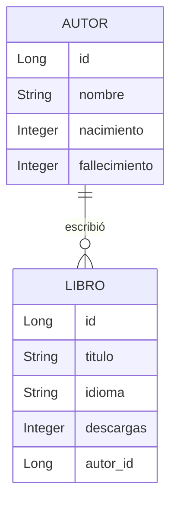

# CHALLENGE-LITERALURA
OBJETIVO: Desarrollar un Catálogo de Libros que ofrezca interacción textual (vía consola) con los usuarios, proporcionando al menos 5 opciones de interacción. Los libros se buscarán a través de una API específica. La información sobre la API y las opciones de interacción con el usuario se detallará en la columna "Backlog"/"Listo para iniciar"
Descripción del Proyecto
LiterAlura es una aplicación Java que permite buscar, almacenar y gestionar información sobre libros y autores utilizando la API pública de Gutendex. La aplicación ofrece un menú interactivo para realizar diversas operaciones con datos literarios y está desarrollada con Spring Boot y PostgreSQL.

## Características Principales 🚀

✅ Búsqueda de libros por título en Gutendex API

✅ Almacenamiento de libros y autores en base de datos PostgreSQL

✅ Gestión de relaciones entre autores y libros

✅ Estadísticas por idioma

✅ Búsqueda de autores vivos en un año específico

✅ Listado de libros por idioma

✅ Interfaz de línea de comandos interactiva

## Tecnologías Utilizadas 📋

- Java 17

- Spring Boot 3.5.3

- Spring Data JPA

- Hibernate (ORM)

- PostgreSQL 14+

- Jackson (JSON processing)

- Gutendex API

- Maven (gestión de dependencias)

## Estructura del Proyecto 📁
```
src/main/java/com/Oracle_One/LiterAluraApplication/
├── APIService.java          // Servicio para consumir la API de Gutendex
├── Autor.java               // Entidad para autores
├── AutorRepository.java     // Repositorio para operaciones con autores
├── DatosAutor.java          // DTO para datos de autor desde la API
├── DatosLibro.java          // DTO para datos de libro desde la API
├── Libro.java               // Entidad para libros
├── LibroRepository.java     // Repositorio para operaciones con libros
├── LiterAluraApplication.java // Clase principal (punto de entrada)
└── LiterAluraService.java   // Servicio principal con lógica de negocio y menú

src/main/resources/
└── application.properties   // Configuración de la aplicación y base de datos

pom.xml                     // Archivo de configuración de Maven
```

## Requisitos Previos 📋
- Java JDK 17 instalado

- PostgreSQL 14+ instalado y configurado

- Maven instalado (opcional, se puede usar el wrapper)

- Conexión a internet (para acceder a Gutendex API)

## Configuración Inicial ⚙️
1. Crear base de datos en PostgreSQL
sql
CREATE DATABASE literalura;
2. Configurar las credenciales
Editar src/main/resources/application.properties:
 ```
properties
spring.datasource.url=jdbc:postgresql://localhost:5432/literalura
spring.datasource.username=tu_usuario
spring.datasource.password=tu_contraseña
spring.jpa.hibernate.ddl-auto=update
3. Instalar dependencias
bash
./mvnw clean install
Ejecución de la Aplicación
bash
./mvnw spring-boot:run
```
3. Dependencias Claves (pom.xml)
```
xml
<dependencies>
    <!-- Spring Boot -->
    <dependency>
        <groupId>org.springframework.boot</groupId>
        <artifactId>spring-boot-starter-data-jpa</artifactId>
    </dependency>
    <dependency>
        <groupId>org.springframework.boot</groupId>
        <artifactId>spring-boot-starter-web</artifactId>
    </dependency>

    <!-- PostgreSQL -->
    <dependency>
        <groupId>org.postgresql</groupId>
        <artifactId>postgresql</artifactId>
        <scope>runtime</scope>
    </dependency>

    <!-- Jackson -->
    <dependency>
        <groupId>com.fasterxml.jackson.core</groupId>
        <artifactId>jackson-databind</artifactId>
        <version>2.16.1</version>
    </dependency>

    <!-- HTTP Client -->
    <dependency>
        <groupId>org.apache.httpcomponents</groupId>
        <artifactId>httpclient</artifactId>
        <version>4.5.14</version>
    </dependency>
</dependencies>
```
## Funcionalidades del Menú
Al iniciar la aplicación, se mostrará el siguiente menú interactivo:

```
=== LITERALURA - MENÚ PRINCIPAL ===
1. Buscar libro por título
2. Listar todos los libros
3. Listar todos los autores
4. Buscar autores vivos en un año
5. Mostrar libros por idioma
6. Mostrar estadísticas de idiomas
0. Salir
```

## Descripción de las opciones:
\-Buscar libro por título: Busca un libro en Gutendex API por título y lo guarda en la base de datos

\-Listar todos los libros: Muestra todos los libros almacenados en la base de datos

\-Listar todos los autores: Muestra todos los autores registrados con sus datos biográficos

\-Buscar autores vivos en un año: Encuentra autores que vivían en un año específico

\-Mostrar libros por idioma: Lista libros filtrados por idioma (código de 2 letras)

\-Mostrar estadísticas de idiomas: Muestra cantidad de libros por idioma

\-Salir: Termina la aplicación

## Modelo de Datos



## Notas de Implementación
\-La aplicación utiliza Hibernate para la generación automática del esquema de base de datos

\-Las relaciones entre entidades se gestionan con anotaciones JPA (@OneToMany, @ManyToOne)

\-La comunicación con la API se realiza mediante HttpClient de Java

\-El menú interactivo se implementa con Scanner y un bucle do-while

\-Los registros se validan para evitar duplicados (@Column(unique = true))

## Ejemplo de Uso
```
=== LITERALURA - MENÚ PRINCIPAL ===
1. Buscar libro por título
2. Listar todos los libros
3. Listar todos los autores
4. Buscar autores vivos en un año
5. Mostrar libros por idioma
6. Mostrar estadísticas de idiomas
0. Salir
Seleccione una opción: 1

Ingrese el título del libro: Don Quijote

Libro registrado exitosamente:
Título: Don Quijote
Autor: Miguel de Cervantes Saavedra
Idioma: es
Descargas: 52341
```

## Solución de Problemas ⚠️
Si encuentras errores de conexión a la base de datos:

- Verifica que PostgreSQL esté corriendo

- Confirma las credenciales en application.properties

- Asegúrate de que la base de datos "literalura" exista

- Verifica los permisos del usuario de PostgreSQL

